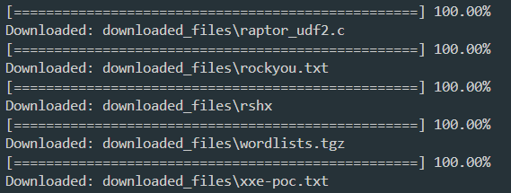
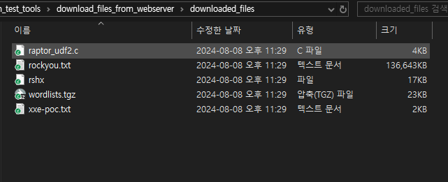

# 특정 폴더 내 모든 파일 및 폴더 다른 호스트로 이동

해당 스크립트는 같은 네트워크 대역(LAN)에 존재하지만 다른 디바이스를 사용하는 호스트 간에 파일을 전송하기 위해 만들었습니다.
<br>

즉 옮기고자 하는 파일이 존재하는 폴더로 이동 후, `python -m http.server 8000`과 같이 간단히 웹 서버를 실행 한 후, 해당 웹 서버의 주소를 스크립트 내 `base_url`에 입력 후, 스크립트를 실행하면, 로컬 PC 내 `downloaded_files` 폴더에 웹 서버를 실행한 폴더의 모든 파일(및 폴더)이 저장됩니다.

# Examples

**웹 서버 대상 PC IP:**

- `192.168.56.16`(Kali Linux)

**다운로드 할 PC IP:**

- `192.168.0.10`(Windows 10)

---

**1. 옮기고자 하는 파일들이 존재하는 폴더로 이동 후, 웹 서버 실행(8000번 포트)**

```bash
cd /your/folder/name
```

```bash
python -m http.server 8000
```

**2. `download_files_from_webserver.py` 스크립트 내 `base_url`을 실행한 웹 서버의 URL로 할당**

```
base_url = http://192.168.56.16:8000/
```

**3. 해당 스크립트 실행**





